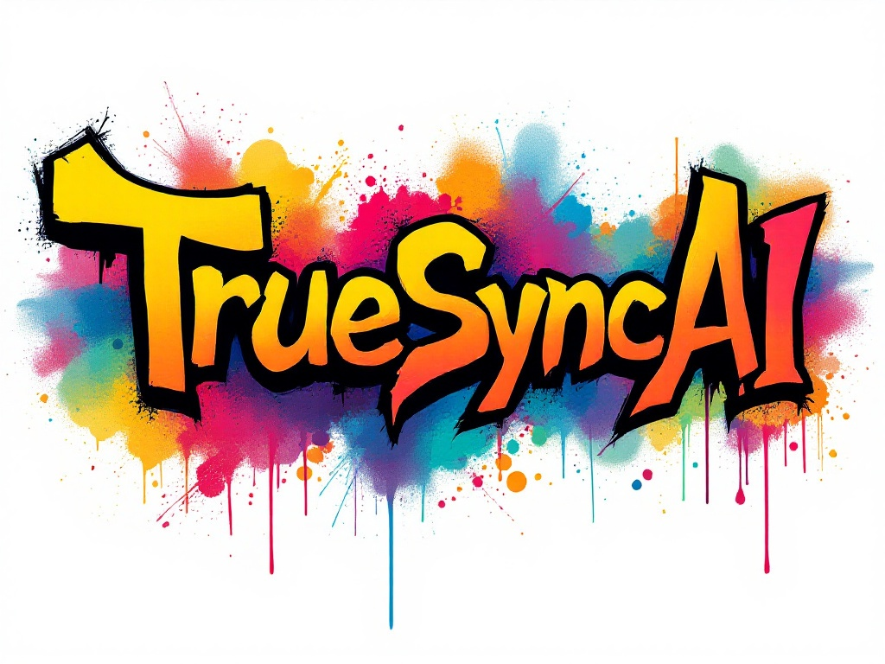

# TrueSyncAI-ChatAPI



---

# Documentation

TrueSyncAI is a pioneering artificial intelligence startup focused on bringing virtual versions of individuals into the real world, redefining human-AI interaction. Our API provides seamless access to our state-of-the-art language model powered by Llama 3.3 70B.

## 🚀 Features

- Advanced conversational AI capabilities
- Secure API key authentication
- Rate limiting for stable performance
- Low-latency responses
- High availability
- Simple REST API interface

## 📋 Prerequisites

- Python 3.8 or higher
- Flask framework
- Valid API key from TrueSyncAI

## 🔑 Authentication

All API requests require an API key. To obtain an API key:

1. Make a POST request to the `/generate_api_key` endpoint
2. Store the returned API key securely
3. Include the API key in all subsequent requests

Example API key format:
```
TrueSyncAI-<random_hex>-<signature>
```

## 🛠️ API Endpoints

### Generate API Key

```http
POST /generate_api_key
```

Response:
```json
{
    "api_key": "TrueSyncAI-a1b2c3d4..."
}
```

### Chat Endpoint

```http
POST /chat
Content-Type: application/json

{
    "api_key": "your-api-key",
    "message": "Your message here"
}
```

Response:
```json
{
    "response": "AI generated response"
}
```

## 📊 Rate Limits

- 100 requests per hour per API key
- Exceeded limits return 429 status code

## 💻 Usage Example

```python
import requests

API_URL = "https://api.truesync.ai"
API_KEY = "your-api-key"

def chat_with_ai(message):
    response = requests.post(
        f"{API_URL}/chat",
        json={
            "api_key": API_KEY,
            "message": message
        }
    )
    return response.json()

# Example usage
response = chat_with_ai("Tell me about TrueSyncAI")
print(response["response"])
```

## 🔒 Security Best Practices

1. Never share your API key
2. Store API keys in environment variables
3. Implement proper error handling
4. Use HTTPS for all requests
5. Rotate API keys periodically

## ⚠️ Error Codes

| Status Code | Description |
|------------|-------------|
| 200 | Success |
| 400 | Bad Request |
| 401 | Invalid API Key |
| 429 | Rate Limit Exceeded |
| 500 | Server Error |

## 🌟 Example Applications

1. **Customer Service Bot**
   - Integrate AI-powered responses into your customer service platform
   - Handle common queries automatically
   - Escalate complex issues to human agents

2. **Personal AI Assistant**
   - Create personalized AI companions
   - Schedule management
   - Information retrieval and summarization

3. **Educational Tools**
   - Create interactive learning experiences
   - Provide instant tutoring assistance
   - Generate educational content

## 📈 Performance Metrics

- Average Response Time: <500ms
- Uptime: 99.9%
- Success Rate: 99.5%

## 🔄 Versioning

Current Version: 1.0.0

We use Semantic Versioning (SemVer):
- MAJOR version for incompatible API changes
- MINOR version for backwards-compatible functionality
- PATCH version for backwards-compatible bug fixes

## 📞 Support

- Email: support@truesync.ai
- Documentation: https://docs.truesync.ai
- Status Page: https://status.truesync.ai

## 👥 Team

- Sujal Rajpoot - Co-founder
- Anuj Rajpoot - Co-founder

## 📄 License

This project is licensed under the MIT License - see the [LICENSE](LICENSE) file for details.

---

© 2025 TrueSyncAI. All rights reserved.
